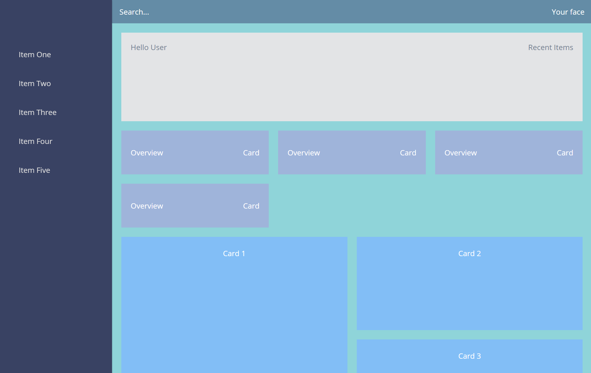
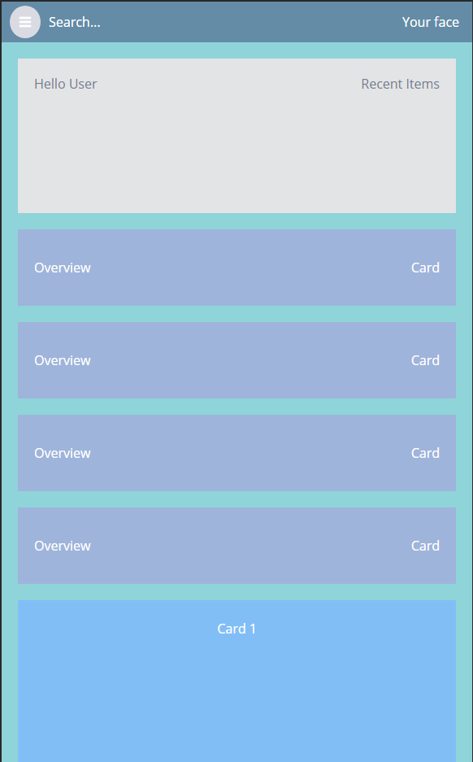

# css-grid-dashboard

My CSS grid practice for a modern responsive dashboard.

## Main Structure

```html
<div class="grid-container">
  <header class="header"></header>
  <aside class="sidenav"></aside>
  <main class="main"></main>
  <footer class="footer"></footer>
</div>
```

## Snapshots

### Web



### Mobile




## Reference

[Matt Holland](https://medium.com/@mtholland10)
